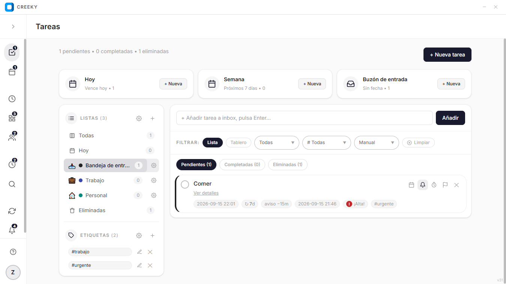

<h1 align="center">
  Creeky
</h1>

<p align="center">
  
  
  
  
  
  
</p>

<p align="center">
  
</p>

Creeky es una aplicación de productividad personal para organizar tareas, tiempo y hábitos en un solo lugar. Todo funciona en local, sin servidores, con tus datos guardados en el navegador.

---

## Funcionalidades

- **Tareas y listas** con prioridades, fechas, duración, repetición por días, etiquetas y descripción. Vista lista y tablero Kanban con arrastrar y soltar.
- **Calendario** con vistas año, mes, semana, día y rangos, conectado a las tareas por fecha y repetición.
- **Pomodoro** 25/5/15 con anillo progresivo, historial filtrable y reserva de sesiones por tarea.
- **Matriz Eisenhower** Q1–Q4 vinculada a la prioridad, arrastra para cambiar prioridad.
- **Hábitos** con tabla semanal, racha y mejor racha, recordatorio diario y archivado automático cada lunes.
- **Cuenta regresiva** manual y automática desde tareas con fecha, con progreso y edición.
- **Búsqueda** en vivo por título, descripción y etiquetas con filtros por lista, prioridad y estado.
- **Notificaciones** tipadas con paginación y marcado de leídas.
- **Sincronización** con exportar e importar JSON y visor de colecciones.
- **Perfil** con estadísticas por lista y prioridad, racha y foco, y preferencias locales.

---

## Arquitectura

Estructura modular basada en features, con React + TypeScript y Tailwind CSS. Cada dominio vive en `src/features/` con sus componentes, hooks y servicios aislados. El estado se gestiona en el frontend con `localStorage` (`creeky_db_v1`), sin backend activo y sin librerías de estado externas. Componentes base reutilizables en `src/components/ui/` (Modal, Select, Button, Input, Tooltip, Pagination, ConfirmDialog) y utilidades en `src/utils/` y `src/hooks/`. Ventana de escritorio con PyWebView.

---

## Requisitos

- Node 18+
- Python 3.10+

---

## Instalación

Clona el repositorio:

```bash
git clone https://github.com/Zerik-Official/Creeky
cd Creeky
```

### Frontend

```bash
cd app
npm install
```

### Backend (ventana de escritorio)

**Windows:**

```bash
cd app

# Inicializa un entorno virtual
python -m venv venv
venv\Scripts\activate

# Instala las dependencias
pip install -r requirements.txt

# Copia el .env.example a .env y edita las variables si es necesario
copy .env.example .env
```

**Linux / macOS:**

```bash
cd app

# Inicializa un entorno virtual
python3 -m venv venv
source venv/bin/activate

# Instala las dependencias
pip install -r requirements.txt

# Copia el .env.example a .env y edita las variables si es necesario
cp .env.example .env
```

---

## Ejecución

### Desarrollo (frontend)

```bash
cd app
npm run dev
```

Disponible en http://localhost:5173

### Escritorio (PyWebView)

**Windows:**

```bash
cd app
venv\Scripts\activate
python desktop/main.py
```

**Linux / macOS:**

```bash
cd app
source venv/bin/activate
python desktop/main.py
```

En modo desarrollo la ventana carga el servidor de Vite. En producción usa el build de `dist`.

### Build de producción

```bash
cd app
npm run build
```

---

## Estructura del proyecto

```
Creeky/
├── .github/
│   └── preview.png
├── app/
│   ├── desktop/
│   │   ├── bootstrap.py
│   │   ├── config.py
│   │   └── core/
│   ├── src/
│   │   ├── App.tsx
│   │   ├── main.tsx
│   │   ├── assets/
│   │   │   └── icons/
│   │   ├── components/
│   │   │   ├── layout/
│   │   │   │   ├── AppLayout.tsx
│   │   │   │   ├── Sidebar.tsx
│   │   │   │   ├── TitleBar.tsx
│   │   │   │   └── TopBar.tsx
│   │   │   └── ui/
│   │   │       ├── Button.tsx
│   │   │       ├── Input.tsx
│   │   │       ├── Textarea.tsx
│   │   │       ├── Select.tsx
│   │   │       ├── Modal.tsx
│   │   │       ├── ConfirmDialog.tsx
│   │   │       ├── Tooltip.tsx
│   │   │       ├── Dropdown.tsx
│   │   │       ├── Pagination.tsx
│   │   │       └── Toast.tsx
│   │   ├── features/
│   │   │   ├── auth/
│   │   │   ├── tasks/
│   │   │   ├── calendar/
│   │   │   ├── pomodoro/
│   │   │   ├── eisenhower/
│   │   │   ├── habits/
│   │   │   ├── countdown/
│   │   │   ├── search/
│   │   │   ├── sync/
│   │   │   ├── notifications/
│   │   │   ├── help/
│   │   │   └── profile/
│   │   ├── hooks/
│   │   │   ├── useCreekyStore.ts
│   │   │   ├── useAppView.ts
│   │   │   ├── useBadges.ts
│   │   │   └── useReminders.ts
│   │   ├── services/
│   │   │   └── storage/
│   │   ├── styles/
│   │   │   ├── index.css
│   │   │   └── main.css
│   │   ├── types/
│   │   │   └── creeky.ts
│   │   └── utils/
│   │       ├── date.ts
│   │       ├── task.ts
│   │       ├── navigation.ts
│   │       └── notifications.ts
|   ├── .env.example
│   ├── package.json
│   ├── vite.config.ts
│   └── requirements.txt
└── README.md
```